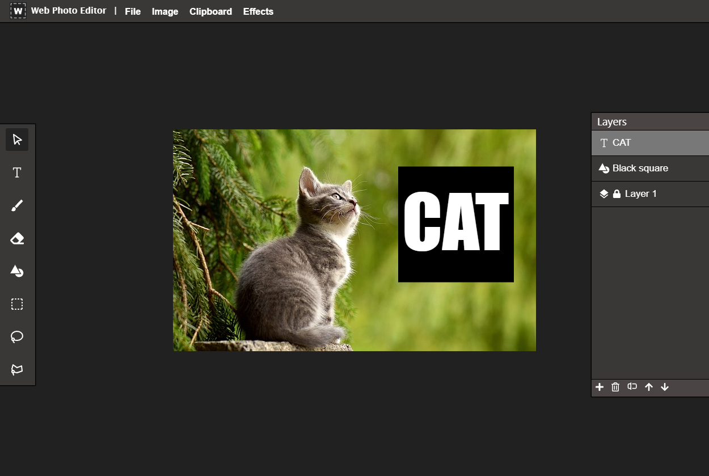

# Web Photo Editor

Web Photo Editor is a simple photo editing application that is built using React.js primarily utilizing HTML Canvas and OpenCV.js. The application lets users upload images and features editing capabilites such as filters, shapes, and text with a layering system. This project was built as a project exam for university.

## Features

- **Image Upload & Editing**: Supports local image uploads for direct editing.
- **Tools**: Crop, rotate, resize, erase, and draw using brushes of different sizes.
- **Selection**: Polygonal selection, rectangle selection and lasso selection.
- **Filters**: Apply Gaussian blur, Sobel edge detection, binary thresholding, and more.
- **Layers**: Manage multiple image layers (add, delete, rename, reorder).
- **Color Management**: Use the color picker to customize outlines, fills, and brush colors.
- **Shapes**: Add and customize shapes with color fills and outlines.

## Technologies Used

- React.js
- HTML5 Canvas API
- CSS
- JavaScript
- OpenCV.js

